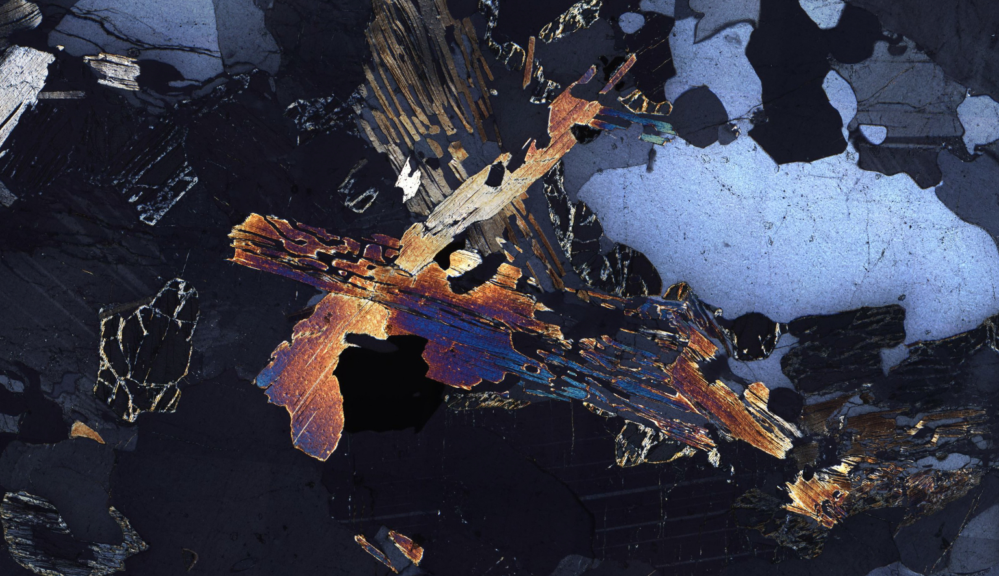

# ThinSectionCinema

Tile viewer and movie maker for cinematic Thin Section exploration.
Made with [openFrameworks](https://openframeworks.cc/).



Includes [TOML++](https://marzer.github.io/tomlplusplus/index.html) header file for parsing config files.

`ofxFFmpegRecorder` code adapted from [NickHardeman/ofxFFmpegRecorder](https://github.com/NickHardeman/ofxFFmpegRecorder).

## Build instructions

1. clone [openFrameworks](https://github.com/openframeworks/openFrameworks)
2. clone this repository into `openFrameworks/apps/myApps/`
3. clone the following addons into `openFrameworks/addons/`
    - [ofxAnimatable](https://github.com/armadillu/ofxAnimatable)
    - [ofxCsv](https://github.com/paulvollmer/ofxCsv.git)
4. in this repo run `make -j8` to build
5. setup a tile scan folder of images and the `config.toml`
6. `./bin/thinsections` to run.

## Tile scans folder format

The tiles need to be jpgs in the following folder structure:

```directory
<scan_name>                       <-- The name of the sample 
├── 2.0                           <-- Zoom level (powers of 2)
│   ├── 0.0                       <-- Polarisation angle (degrees)
│   │   ├── <x>x<y>x<w>x<h>.jpg   <-- Tile name
│   │   └── ...
│   ├── 18.0
│   ├── 36.0
│   └── ...
├── 4.0
├── 8.0
├── ...
└── poi.csv                       <-- Coordinates of points of interest
```

The jpgs filenames should contain the position and size (in pixels) for that zoom level.

The (optional) `poi.csv` file should have the following headings: `index, x, y, theta`.
`x` and `y` are normalised floats in `[0, 1]`.
`theta` is optional and unused for now.

## Config

Copy `config_template.toml` to `bin/data/config.toml` and edit with the following options:

- `scans_root` (required) Root folder of all scans. Must end in '/'.
- `scan_layout` (optional) JSON file to load the layout.
- `min_moving_time`, `max_moving_time` (optional) Defaults 8.0, 45.0. Min/Maximum time (in seconds) to move between targets.
- `recording_folder` (optional) Absolute path to folder that recordings will save to.
- `recording_filename` (optional) Name of saved recording (without `.mp4`). If not specified, the default name will be the time and date.
- `recording_fps` (optional) Default 60. Frames per second of output recording.

## License

Released under [GNU General Public License v3](LICENSE)
